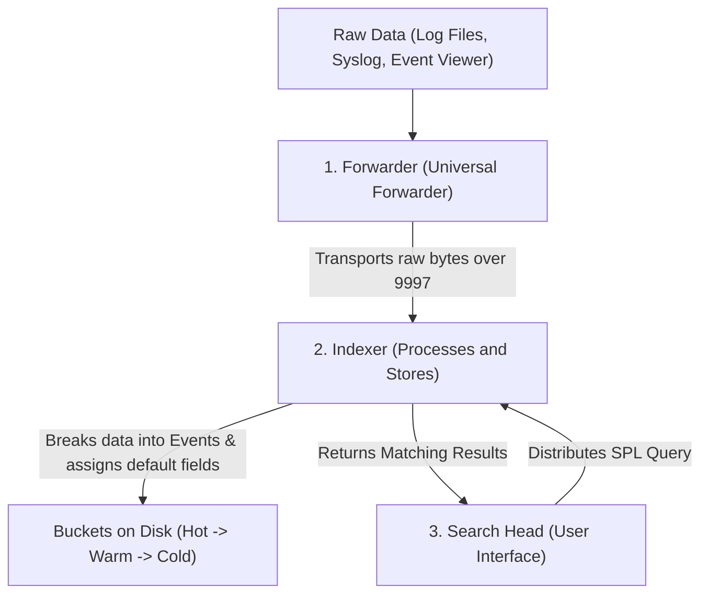

# 🛡️ Splunk Master Learning Path & Hands-On SIEM Workbook

Welcome to your structured guide for accelerating and mastering your knowledge in **Splunk**. Whether you are preparing for certifications or leveling up as a Security Analyst / Threat Hunter, this learning path provides the perfect mixture of theory, free resources, and practical exercises.

---

## 🏛️ Module 1: The Splunk Core Architecture

To master Splunk, you must understand how data flows from a server's raw text files into the Search Head where you query it. Splunk operates on a **three-tier architecture**:



### 🔑 High-Yield Exam Concepts:
1. **Universal Forwarder (UF)**: A lightweight agent installed on endpoint systems (like domain controllers, web servers). It consumes minimal resources, has no GUI, and simply forwards raw logs.
2. **Indexer**: The "database engine." It receives raw data, parses it, separates it into individual events, extracts **default metadata fields** (`host`, `source`, `sourcetype`, `_time`), and saves it in structured time-series directories called **buckets** on disk.
3. **Search Head (SH)**: The graphical interface. It distributes searches to indexers and aggregates results. It does *not* store data; it coordinates searches.

---

## 📈 Module 2: The Splunk Certification & Training Roadmap

Splunk provides an excellent, structured certification path. The first two credentials are highly respected in the industry:

```
[ Splunk Core Certified User ] ➡️ [ Splunk Core Certified Power User ] ➡️ [ Splunk Enterprise Certified Admin ]
```

### 1. 🎓 Splunk Core Certified User
* **Who it is for**: Beginners learning how to search, write reports, and build basic dashboards.
* **Key Topics tested**: Basic searching, search terms, boolean operators, using fields, transforming commands (`stats`, `chart`), and reporting.
* **Free Prep Strategy**:
  - Register for the **free** official Splunk training: **[Splunk Work Basics (eLearning)](https://www.splunk.com/en_us/training/free-courses/splunk-work-basics.html)**.
  - Review the **[Splunk Certified User Exam Blueprint](https://www.splunk.com/pdfs/training/splunk-test-blueprint-user.pdf)**.

### 2. ⚡ Splunk Core Certified Power User
* **Who it is for**: Intermediate users who want to master **Knowledge Objects**.
* **Key Topics tested**: Lookups, eventtypes, tags, transaction command, aliases, field extractions, and search macros.
* **Free Prep Strategy**:
  - Register for **[Splunk Knowledge Management (eLearning)](https://www.splunk.com/en_us/training/free-courses/knowledge-management.html)**.
  - Review the **[Splunk Certified Power User Exam Blueprint](https://www.splunk.com/pdfs/training/splunk-test-blueprint-power-user.pdf)**.

---

## 🛠️ Module 3: Hands-On Splunk Practice Platforms

Reading documentation is helpful, but you will learn 90% of your skills by searching actual security datasets. Bookmark these three practical resources:

### 1. 🥇 Splunk "Boss of the SOC" (BOTS)
Splunk hosts an annual capture-the-flag (CTF) tournament called Boss of the SOC. They release the raw datasets for free on GitHub! These contain realistic Windows event logs, firewall logs, Active Directory telemetry, and DNS queries during an actual mock cyber-attack.
* **How to practice**: Download the free **BOTS v1** or **BOTS v2** datasets and load them into a local Splunk sandbox. It is the gold standard for SOC analyst preparation.

### 2. 🎮 TryHackMe Splunk Rooms
TryHackMe has excellent, guided learning rooms where they provide a pre-installed Splunk instance and ask you to answer investigation questions:
* **[Splunk: Basic](https://tryhackme.com/room/splunk101)**: Learn SPL syntax, filtering, and time ranges.
* **[Splunk: Research & Development](https://tryhackme.com/room/splunkrd)**: Learn how to analyze adversary behaviors.
* **[Benign](https://tryhackme.com/room/benign)**: Hunt for persistence mechanism footprints.

### 3. 🛡️ CyberDefenders
Provides real-world security blue team training labs. You can download packet captures and disk/memory images, or query pre-loaded SIEM systems to track threat actors.

---

## 🔍 Module 4: The SPL (Search Processing Language) Hunting Cheat Sheet

Master these essential commands to write efficient searches.

### 1. Basic Filters
* **Boolean Operators** (MUST be uppercase): `AND`, `OR`, `NOT`
  ```spl
  index=main sourcetype=web_access NOT status_code=200
  ```
* **Wildcards** (`*` matches any character):
  ```spl
  src_ip="192.168.1.*" user="admin*"
  ```

### 2. Transforming Commands
Transforming commands format your raw event logs into statistical tables.
* **`stats`**: Perform aggregate math on your data.
  - `count`: Total events.
  - `dc(field)`: Distinct Count (unique count).
  - `avg(field)`: Average response time.
  ```spl
  index=main event_type=web_access 
  | stats count, dc(src_ip) as "Unique IPs", avg(web.response_ms) as "Avg Latency" by web.uri
  ```
* **`top`**: Displays the most common values.
  ```spl
  index=main event_type=auth_audit auth.auth_status="failed" 
  | top limit=5 auth.user
  ```
* **`rare`**: Displays the least common values (useful for spotting anomalies).
  ```spl
  index=main event_type=web_access 
  | rare limit=3 web.user_agent
  ```

### 3. Field Manipulation & Layout
* **`table`**: Renders only the listed fields in a structured table.
  ```spl
  index=main event_type=threat_alert 
  | table timestamp, src_ip, alert.signature, alert.severity
  ```
* **`rename`**: Changes a field label for display.
  ```spl
  index=main event_type=web_access 
  | rename src_ip as "Attacker IP", web.uri as "Target URI"
  ```
* **`dedup`**: Removes duplicates from your output.
  ```spl
  index=main event_type=web_access 
  | dedup src_ip 
  | table src_ip, geo.country
  ```
* **`sort`**: Sorts results. Prefix with `-` for descending or `+` (default) for ascending.
  ```spl
  index=main event_type=web_access 
  | sort - web.response_ms
  ```

---

## 📈 Module 5: Your Hands-On Lab Tasks (Using `live_splunk_lab.py`)

You now have a fully customized log integration engine running in `C:\Users\trivi\.gemini\antigravity\scratch\newgeminisplunk\`. It connects to the web, fetches IP details, geolocates them, scores them for threat level, and logs them in JSON lines format.

### Step 1: Generate Logs
Run your live script in PowerShell to populate your lab environment:
```powershell
# Run the integration script once to fetch your public IP, geolocate it, and generate 5 enriched logs
python live_splunk_lab.py --run-once
```

### Step 2: Configure Splunk Ingestion
In your Splunk Enterprise Web Console:
1. Go to **Settings** -> **Add Data** -> **Monitor**.
2. Under **Files & Directories**, select **Keep monitoring this file** and paste your file path:
   `C:\Users\trivi\.gemini\antigravity\scratch\newgeminisplunk\live_splunk_logs.log`
3. Click **Next**. For **Source Type**, select **Structured** -> **_json** (or type `_json`).
   - *Note: Splunk automatically detects the JSON structure and extracts fields like `geo.country` and `threat_intel.threat_score` instantly!*
4. Select/create the index `main` and click **Submit**.

### Step 3: Run Threat Hunting Queries!
Once ingested, set your search window time to **All Time** and run these target SPL queries to see your live integration in action:

#### 1. Geolocation Map of Incoming Requests
```spl
source="*live_splunk_logs.log" event_type=web_access
| stats count by geo.country, geo.city
| sort - count
```

#### 2. High Risk Threat Hunting (Identify malicious IP sources)
Find which IPs are triggering attacks and their details:
```spl
source="*live_splunk_logs.log" threat_intel.threat_score>70
| stats count, max(threat_intel.threat_score) as MaxScore by src_ip, geo.isp, threat_intel.classification, threat_intel.threat_actor
| sort - MaxScore
```

#### 3. Web Attack Analysis (Find user agents and URI targets)
Analyze what malicious tools are hitting what endpoints:
```spl
source="*live_splunk_logs.log" event_type=web_access web.status_code>=400
| table timestamp, src_ip, geo.country, web.uri, web.status_code, web.user_agent
```

#### 4. Active Streaming Triage
To watch live streaming logs, run the script in stream mode:
```powershell
python live_splunk_lab.py --stream 5
```
Then in Splunk Search bar, toggle **Real-time** search (e.g. "30-second window") with:
```spl
source="*live_splunk_logs.log"
```
You will see your public IP and other revolving threat vectors populating your screen dynamically in real-time!
